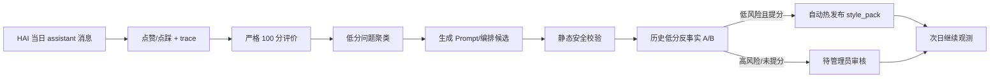

# HAI 每日复盘与受控自动迭代

## 目标

HAI 每天在北京时间 00:05 自动复盘前一自然日的真实用户对话，把“发现低分回答—定位失败层—生成候选改动—离线 A/B—安全发布—次日可用”接成闭环。

这不是让模型无门槛修改自己。系统默认使用 `gated` 模式：

1. 用户点赞/点踩是最强监督信号，点踩回答优先进入样本且总分最高 59 分。
2. 没有反馈的回答由严格 100 分评价器补评，真实问题识别和教学判断权重最高。
3. 稳定失败模式至少需要 3 条低分证据；单日可自动发布前至少需要 10 条有效回答。
4. 候选必须通过历史低分样本的反事实 A/B，平均至少提升 4 分，且不能有维度明显回退。
5. R12/R13 当前链路中只有 `style_pack` 属于自动发布白名单；身份、安全边界、方法论、问题重构和语义路由永远只进入待审核队列。
6. 每晚最多自动发布一处改动，并在 `hai_optimization_log` 保存发布前后完整快照；管理看板可一键回滚最近自动发布。

## 数据链路



## 新增组件

- `hai_message_feedback`：保存每条 assistant 回答的点赞/点踩。
- `hai_optimization_log`：每日运行状态、分数、问题、候选、发布结果和配置快照。
- `hai_daily_review_scheduler_config`：仅 service role 可读的定时调用地址与 secret。
- `hai-daily-review`：执行复盘、候选生成、反事实 A/B 和门禁发布的 Edge Function。
- HAI 对话页：每条回答新增点赞/点踩。
- HAI 管理看板：显示最近复盘、低分数、反馈、发布状态，并支持手动补跑昨日。

## 部署

```bash
supabase db push
supabase functions deploy hai-daily-review --no-verify-jwt
node scripts/configure-hai-daily-review.mjs
```

`--no-verify-jwt` 只关闭 Supabase 网关的 JWT 预校验；函数内部仍强制验证管理员 JWT 或 `x-hai-review-secret`。普通匿名请求无法执行复盘。

### 2026-07-14 线上核验

- 迁移已精确执行，没有使用会夹带历史迁移的宽泛 `supabase db push`。
- `hai-daily-review` 已部署，定时 secret 已同时写入 Edge secret 与服务端调度配置。
- `cron.job` 中 `hai-daily-review-shanghai-midnight` 为 active，表达式 `5 16 * * *`。
- 数据库 `hai_trigger_daily_review()` 到 Edge Function 的真实请求返回 HTTP 200。
- 以 2026-07-13 的 6 条真实回答完成首次烟测：严格均分 88.67，低分 0，候选 0，自动发布 0。因为样本少于 10，即使出现候选也不会自动发布。

部署后核验：

```sql
select jobid, jobname, schedule, active
from cron.job
where jobname = 'hai-daily-review-shanghai-midnight';

select run_date, status, turns_evaluated, average_score, low_score_count, publish_mode, note
from public.hai_optimization_log
order by run_date desc
limit 7;
```

## 运行参数

管理员可在 HAI 配置页调整 `每日复盘` 分类的运行时参数：开关、`gated/review_only`、通过分、最小样本、低分样本门槛、A/B 最低提分和每日最大评估量。

推荐先保持默认 `gated`。若需要只观察不自动上线，把 `daily_review.auto_publish_mode` 改成 `review_only`。

## 明确边界

- 每日复盘只使用 HAI 已有对话数据，不读取其他业务模块的私有内容。
- 原始对话只发给 HAI 当前已经使用的 DeepSeek 服务进行评价，不进入优化日志；日志只保存消息 id、评分和问题摘要。
- 当评价器输出缺失、样本不足、候选膨胀、A/B 不提分或任何调用失败时，默认不改线上配置。
- 核心边界和路由不能由夜间任务直接发布，必须由管理员结合逐题回答和 trace 审核。
