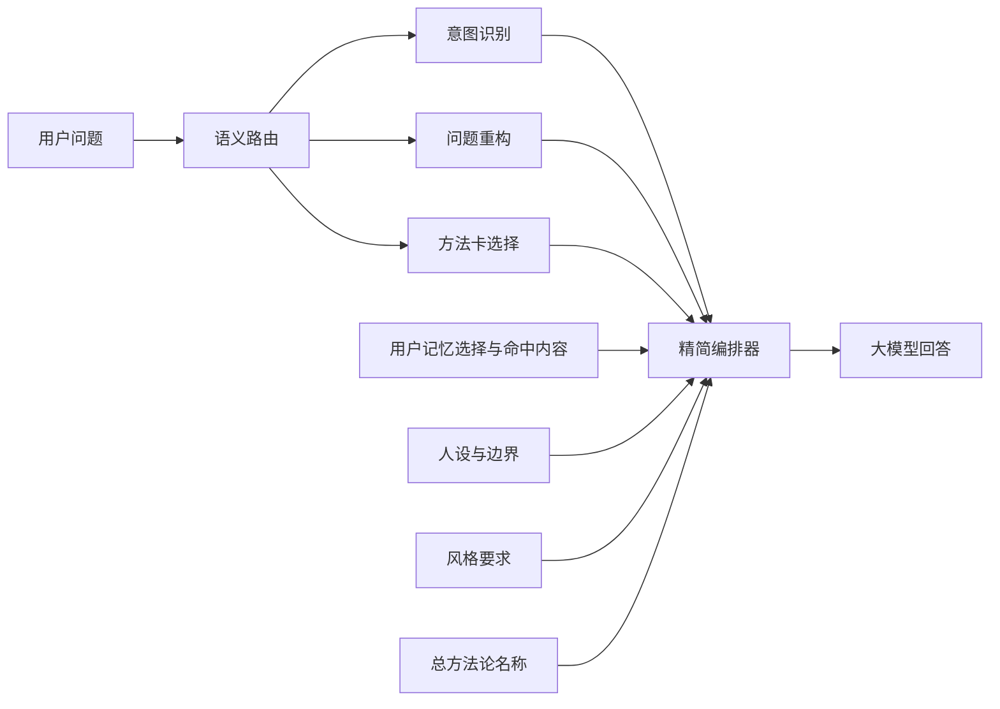

# HAI 完整提示词快照与精简编排机制

> 版本：R13 已发布
> 更新时间：2026-07-13

## 1. 本轮目标

R12 同时解决两个问题。

1. 每次调试都能保存 AI 回答、实际发给模型的完整 `messages`、估算 token、语义路由和质检 trace。
2. 主回答编排只保留人设与边界、总方法论名称、意图识别、用户记忆选择与命中内容、问题重构、方法卡和风格要求。

R13 继续精简独立的 `semantic_router` 调用：不再重复注入三段可配置判断规则，也不再把 35 张方法卡的全部详情一次性发送给模型。

## 2. 完整提示词快照

### 2.1 捕获范围

`hai-chat` 接受调试参数：

```json
{
  "capturePromptSnapshot": true
}
```

开启后，`done` SSE 事件的 `promptSnapshot.model_calls` 会按实际调用顺序保存：

- `semantic_router`：意图、问题重构、诊断模块和方法卡路由时实际发送的完整 messages。
- `answer_draft`：生成首轮回答时实际发送的完整 messages。
- `answer_rewrite`：只在质检不通过且触发重写时出现，保存重写调用的完整 messages。

每个模型调用都包含 `stage`、`messages`和 `estimated_input_tokens`，快照同时保存 `final_answer`。

### 2.2 权限和安全边界

- 只有 `hai_access_status().is_admin = true` 的管理员才能请求完整提示词快照；普通用户请求会返回 403。
- 完整提示词不写入 `hai_messages.metadata`。这样可避免普通用户通过消息读权获得系统提示词。
- 完整快照只在管理员测试请求的 SSE 返回值中短暂存在，由本地测试脚本写入 Markdown 和 JSON。
- 完整提示词快照已加入 `.gitignore`，只作为本地审计资料，不推送到公开 GitHub 仓库。
- 文档中不保存登录密码、access token、service role key 或其他密钥。

### 2.3 自动落盘

线上上下文回归脚本：

```bash
node --env-file=.env scripts/run-hai-context-eval.mjs
```

每次执行都会在 `docs/hai-quality-runs/` 生成同名的两份文件：

- `*-context-orchestrator-eval.json`：便于机器对比的完整数据。
- `*-context-orchestrator-eval.md`：便于人工审阅的问题、每次模型调用、完整 messages、AI 回答和 trace。

两个离线 DeepSeek 烟测脚本也已改为每次落盘：

```bash
deno run -A --env-file=.env scripts/run-hai-methodology-routing-smoke.ts
deno run -A --env-file=.env scripts/run-hai-methodology-answer-smoke.ts
```

它们分别生成 `*-methodology-routing-smoke.md` 和 `*-methodology-answer-smoke.md`，每个问题都保存完整 system/user messages 与模型输出。

## 3. R12 精简编排

### 3.1 当前主回答提示词



主回答 system prompt 的固定顺序是：

1. 精简人设。
2. 精简边界。
3. 总方法论标识：只保留“备课流程＋教学设计框架”名称，不展开四步骤、六要素或三个底层领域。
4. 意图识别 JSON。
5. 用户记忆选择 JSON 与真正命中的记忆。
6. 问题重构 JSON。
7. 本轮命中的一至两张方法卡，主卡优先。
8. 精简风格要求。

### 3.2 启停矩阵

| 层 | R12 状态 | 说明 |
|---|---|---|
| HAI 人设与边界 | 开启 | 合并重复规则，保留身份、判断原则、事实边界、交付边界和高风险边界。 |
| 总方法论 | 只保留名称 | 识别名称为“备课流程＋教学设计框架”，具体内容交给方法卡。 |
| 意图识别 | 开启 | 作为判断逻辑入口。 |
| 用户记忆选择 | 开启 | 只加载选择器认为相关的记忆。 |
| 问题重构 | 开启 | 保留表层问题、深层问题、HAI 重构与建议方向。 |
| 方法卡 | 开启 | 核心课程内容；回答必须真正使用方法，不只报名称。 |
| 风格要求 | 开启 | 精简为人称、开头、主线、例子、课程引用、结尾和纯文本格式。 |
| 教学功能层 | 停用 | 不再把当前模块说明注入回答 prompt。 |
| 完整教学通识课方法论 | 停用 | 数据保留，不注入回答 prompt。 |
| 教学公理层 | 停用 | 数据保留。 |
| 诊断框架展开 | 停用 | 路由结果可留在 trace，不向主回答展开。 |
| 检索规划 | 停用 | 可留在 trace，不注入主回答。 |
| 案例库 | 停用 | `orchestrator.case_max = 0`。 |
| 教学设计公式库 | 停用 | Prompt 配置保留但 `enabled = false`。 |
| 用户上传和沉淀素材 | 停用 | `retrieval.material_enabled = false`，主链路也不执行检索。 |
| 方法和理论库 | 停用 | `retrieval.knowledge_enabled = false`。结构化课程方法卡不受影响。 |
| 表达库 | 停用 | `orchestrator.expression_max = 0`。 |
| 方法聚焦重复块 | 停用 | 不再二次复制已命中方法卡。 |
| 独立回答编排层和重复输出契约 | 停用 | 关键规则已合并到人设与风格。 |

## 4. 长度对比

用同一个问题“我设计了一节课，但教学目标、课堂活动和最后的评价总是对不上……”进行对比：

| 指标 | R11 线上快照 | R12 精简编排 | 变化 |
|---|---:|---:|---:|
| system prompt 字符 | 10,445 | 1,920 | -81.6% |
| system prompt 估算 token | 7,577 | 1,360 | -82.1% |
| 当前问题重复 | 2 次 | 1 次 | 已修复 |
| 主回答估算总输入 | 7,655 | 1,399 | -81.7% |

R12 数字是基于相同问题和“目标评价活动逆向设计”方法卡的本地确定性组装结果。线上真实数字会随意图、问题重构、命中记忆、方法卡和对话历史改变，每次测试文档都会记录当次实际 token。

### 4.1 R13 semantic router

R13 将方法目录拆为两层：所有 35 张方法卡只发送 `id｜名称` 索引；本地轻量召回根据当前问题和代码意图，最多补充 6 张候选卡的摘要、适用情境和边界。候选集不是最终结论，模型仍可从完整索引选择其他方法。

三段旧配置 `intent_classifier_prompt`、`problem_rewriter_prompt`、`diagnostic_router_prompt` 不再拼入 router。它们在数据库中保留，R13 迁移后标记为停用。意图识别、问题重构和诊断模块选择没有删除，仍由一次统一的 router 调用完成。

16 题生产同款 DeepSeek 路由烟测全部通过，包含总方法论、六要素、三大底层领域、具体下位方法和无匹配场景：

| 指标 | R12 线上快照 | R13 路由烟测 | 变化 |
|---|---:|---:|---:|
| semantic router 估算输入 token | 6,054 | 平均 1,334 | -78.0% |
| R13 最小 / 最大 | - | 1,133 / 1,821 | 随候选卡数量变化 |
| 方法路由回归 | - | 16 / 16 | 全部通过 |

烟测快照仍完整保存在本机 `docs/hai-quality-runs/*-methodology-routing-smoke.md`，不会提交到公开仓库。

## 5. 代码位置

- 主回答精简编排：`supabase/functions/_shared/hai_orchestrator/response_composer.ts`
- 默认人设、边界与风格：`supabase/functions/_shared/hai_orchestrator/prompts.ts`
- 快照权限、模型调用捕获和 SSE 返回：`supabase/functions/hai-chat/index.ts`
- 前端 SSE 类型：`src/db/hai-api.ts`
- 线上回归与 Markdown 落盘：`scripts/run-hai-context-eval.mjs`
- 方法路由/回答烟测落盘：`scripts/run-hai-methodology-routing-smoke.ts`、`scripts/run-hai-methodology-answer-smoke.ts`
- R13 router prompt：`supabase/functions/_shared/hai_orchestrator/semantic_router_prompt.ts`
- R13 候选方法召回：`supabase/functions/_shared/hai_orchestrator/knowledge/method_bank/han_course_method_cards.ts`
- 后台配置迁移：`supabase/migrations/20260713170000_hai_r12_compact_orchestration.sql`
- R13 后台启停迁移：`supabase/migrations/20260713180000_hai_r13_compact_semantic_router.sql`
- 编排防回归测试：`supabase/functions/_shared/hai_orchestrator/response_composer_test.ts`
- Router 防回归测试：`supabase/functions/_shared/hai_orchestrator/semantic_router_prompt_test.ts`

## 6. 发布与线上核验

2026-07-13 已执行并登记 R12 的 `20260713170000` 与 R13 的 `20260713180000` 迁移，`hai-chat` 已部署为 v14。线上配置核验显示，案例、理论、表达检索上限均为 0，用户素材和通用知识库检索均为 false，完整总方法论、教学公理、公式库、独立回答编排器及三段旧 router 配置均为 disabled。

使用管理员测试账号运行一条真实线上快照，回答生成调用的实际输入为 1,661 tokens，只包含 system 和一次当前 user 问题。人设、意图、记忆选择、问题重构、方法卡和风格全部存在，教学公理、案例、公式、用户素材和通用知识库全部缺席。

R13 发布后的管理员线上快照中，问题“学生不爱听，是否多加游戏和互动”的 `semantic_router` 实际输入为 1,148 tokens，`answer_draft` 为 1,556 tokens。router 完整提示词包含 35 张卡的 id/名称索引，本题没有硬配候选详情；模型仍正确识别 `learning_motivation` 并选择“任务卷入感双层模型”。快照保存在本机 `docs/hai-quality-runs/2026-07-13T09-15-57-019Z-context-orchestrator-eval.*`。
